# Тема 1. Принципы работы LLM

## Введение: Архитектура и размер LLM

### Две ключевые схемы для понимания LLM

#### Схема 1: Как работает LLM

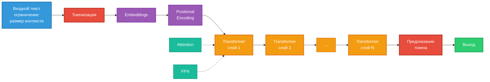

**Поток обработки текста:**
- Трансформер слои — это сердце модели, текст проходит через стопку из N таких слоёв
- **Attention** (механизм внимания) — определяет, какие слова в контексте важны для понимания текущего слова
- **FFN** (Feed-Forward Network) — обрабатывает каждое слово отдельно, применяя найденные связи для извлечения паттернов

#### Схема 2: От чего зависит размер модели

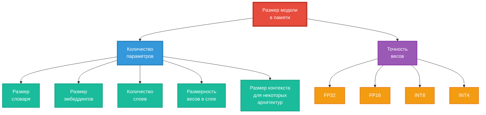

**Факторы, определяющие размер модели:**
- Количество параметров: словарь, эмбеддинги, число слоёв, размерность весов внутри слоя
- Размер контекста влияет на параметры только для архитектур с learned positional embeddings
- Точность весов (FP32/FP16/INT8/INT4) определяет, сколько байт занимает каждый параметр

### 📚 Полезные ресурсы для изучения

**Интерактивные визуализаторы трансформеров:**

- **[LLM Visualization](https://bbycroft.net/llm)** — интерактивный визуализатор работы GPT, где можно пошагово проследить процесс генерации токенов, увидеть работу attention механизма и трансформер слоёв
- **[Transformer Explainer](https://poloclub.github.io/transformer-explainer/)** — наглядная демонстрация архитектуры трансформера с подробными объяснениями каждого компонента

**Статьи:**

- **[The Illustrated Transformer](https://jalammar.github.io/illustrated-transformer/)** (Jay Alammar) — лучшее введение в трансформеры с визуализациями, понятное для начинающих
- **[The Illustrated GPT-2](https://jalammar.github.io/illustrated-gpt2/)** (Jay Alammar) — как работает GPT-2, понятно и наглядно
- **[Understanding Large Language Models](https://magazine.sebastianraschka.com/p/understanding-large-language-models)** (Sebastian Raschka) — отличное введение в LLM
- **[Attention is All You Need](https://arxiv.org/abs/1706.03762)** (Vaswani et al., 2017) — оригинальная статья про архитектуру Transformer

---

## Основы работы LLM

### Слайд 1: Зачем понимать устройство LLM

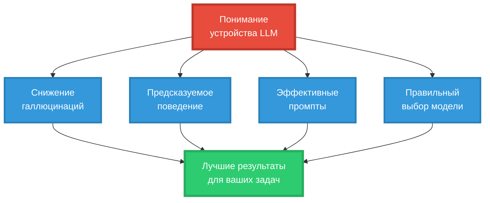

**Зачем нам понимать устройство:**
- Понимание принципов работы LLM помогает управлять её поведением через промпты и контекст
- Мы научимся снижать галлюцинации и делать модель более детерминированной
- Это позволит осознанно выбирать модели под конкретные задачи

### Слайд 2: Главный принцип - паттерны, не мышление

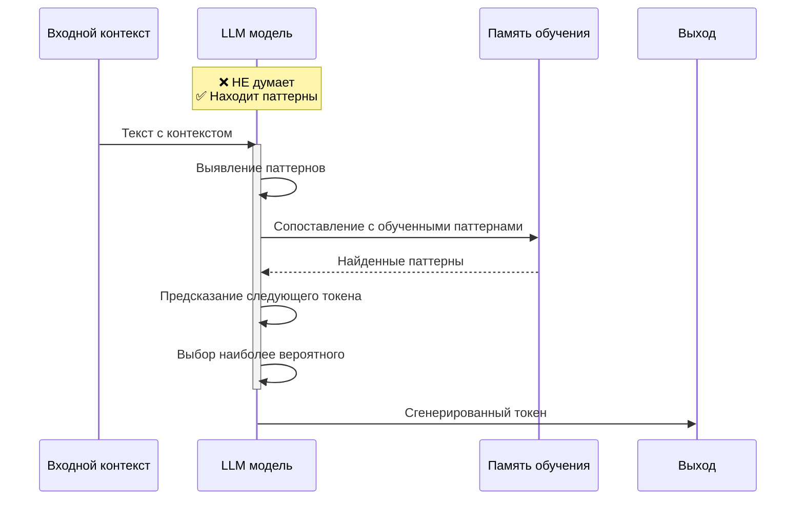

**Критически важно понять:**
- LLM не думает в привычном смысле, а выявляет паттерны в вашем контексте
- Модель сопоставляет найденные паттерны с теми, что изучила во время обучения
- На основе этого она предсказывает следующий наиболее вероятный токен (слово) для данного паттерна

### Слайд 3: Как LLM анализирует контекст

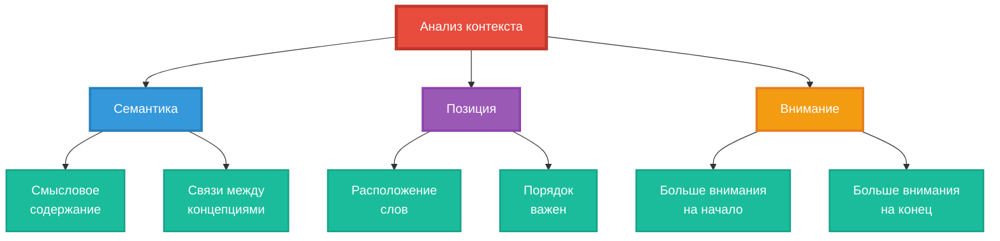

**Три ключевых фактора анализа:**
- **Семантика** — модель понимает смысл и находит семантические связи между словами и концепциями
- **Позиция** — учитывается расположение слов в последовательности, порядок критически важен
- **Внимание** — модель обращает больше внимания на начало (инструкции, контекст) и конец (актуальная информация) входящей последовательности

### Слайд 4: Как помочь LLM найти нужные паттерны

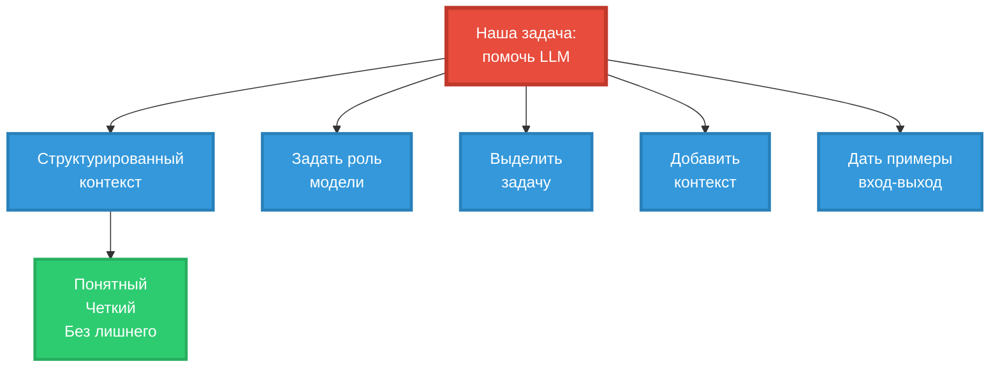

**Техники промпт инжиниринга:**
- Делайте контекст понятным, структурированным и четким — без лишней информации
- Задавайте роль модели, четко выделяйте задачу, добавляйте релевантный контекст
- Давайте примеры входа-выхода (few-shot learning) — это значительно улучшает результаты

### Слайд 5: Инструменты управления поведением

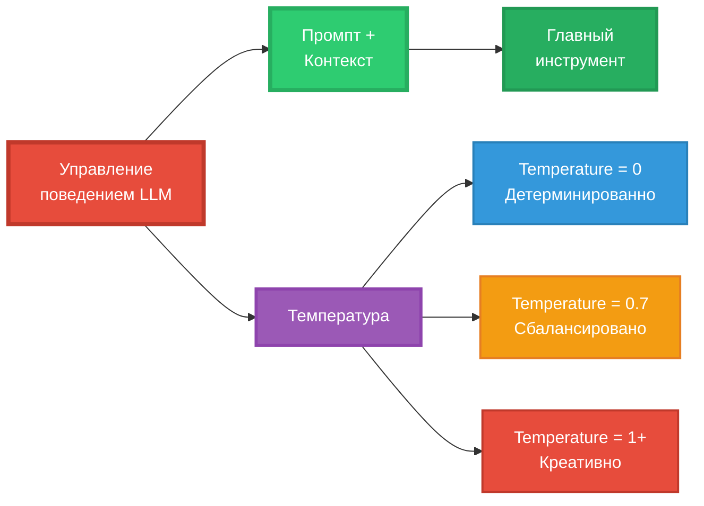

**Наши механизмы управления:**
- **Промпт и контекст инжиниринг** — самый главный инструмент управления поведением модели
- **Температура** — дополнительный регулятор степени случайности: 0 для точности, 0.7 для баланса, 1+ для креативности
- Всё остальное зависит от способностей выбранной модели, полученных на этапе обучения

---

## Ограничения моделей

### Слайд 6: Память и язык модели

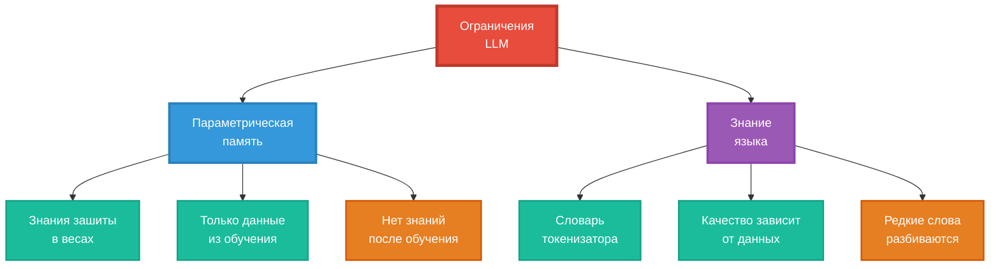

**Фундаментальные ограничения:**
- **Параметрическая память** хранится в весах модели и формируется только из данных обучения — модель не знает о событиях после даты обучения
- **Знание языка** ограничено словарем токенизатора — редкие слова и новые термины разбиваются на части, качество работы зависит от представленности языка в обучающих данных
- Эти ограничения нельзя изменить на этапе использования модели, требуется файн-тюнинг или RAG для добавления новых знаний

### Слайд 7: Размер контекста

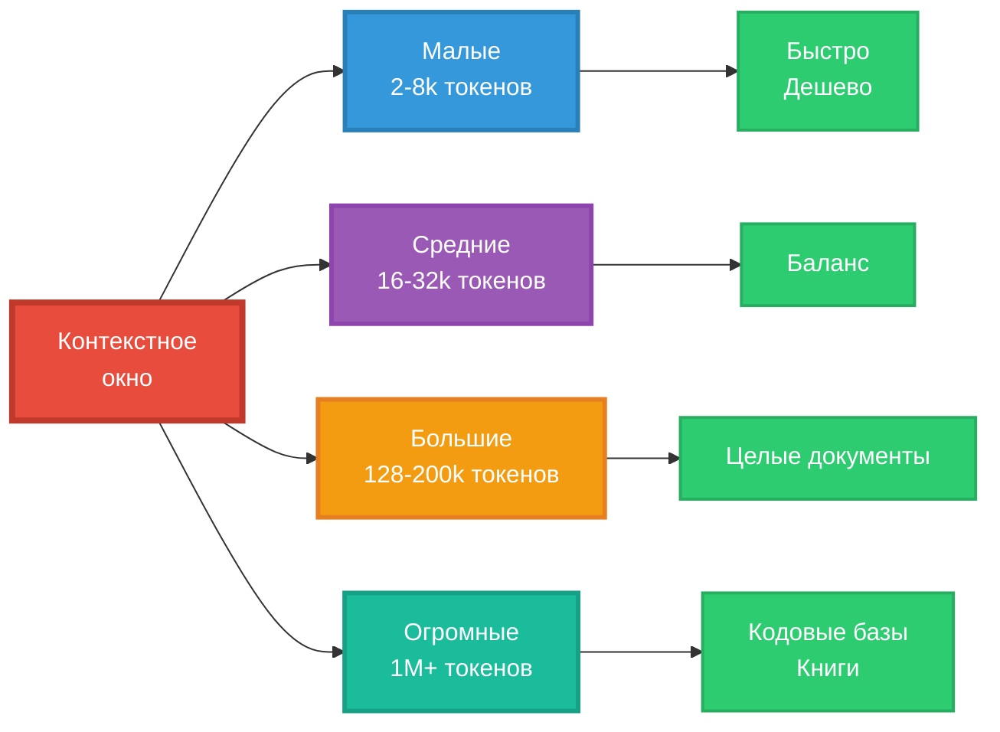

**Ограничение контекстной памяти:**
- Каждая модель имеет фиксированный размер контекстного окна — количество токенов, которое можно обработать за раз
- Малые окна подходят для коротких запросов, большие позволяют обрабатывать целые документы и книги
- Нельзя загрузить всю базу знаний в один промпт — для этого используется RAG (извлечение релевантных фрагментов)

### Слайд 8: Специализированные знания

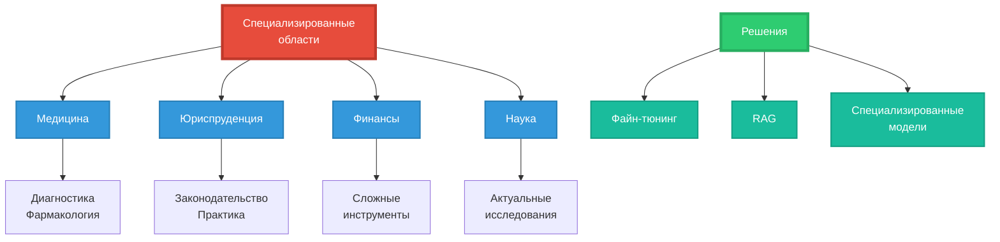

**Ограниченность экспертизы:**
- Модели общего назначения имеют поверхностные знания в специализированных областях (медицина, право, финансы, наука)
- Для работы с экспертными областями нужны файн-тюнинг на специализированных данных, RAG с экспертными базами или использование специализированных моделей
- Чем уже область — тем важнее специализация модели

### Слайд 9: Мультимодальность

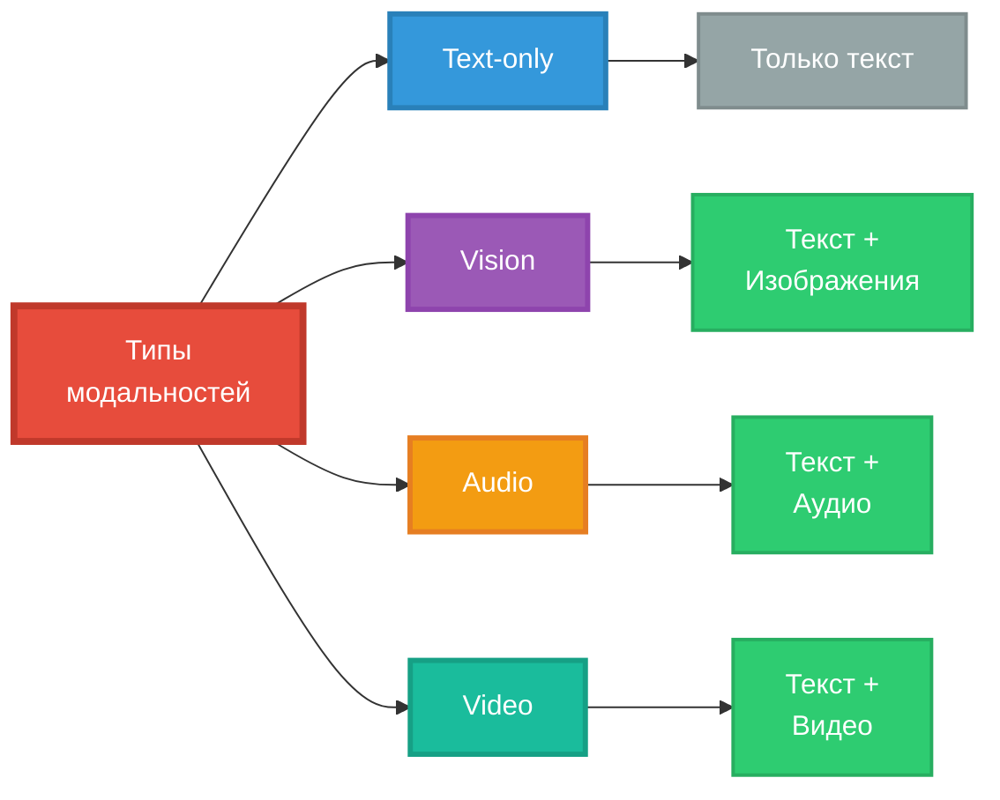

**Работа с разными типами данных:**
- Не все модели умеют работать с разными типами данных — это зависит от обучения
- Text-only модели работают только с текстом, мультимодальные могут обрабатывать изображения, аудио, видео
- Выбор модели зависит от ваших задач: нужна ли обработка изображений, распознавание речи или анализ видео

### Слайд 10: Специальные способности

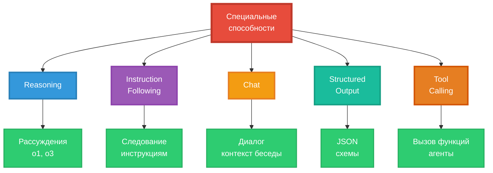

**Различные модели — разные способности:**
- **Reasoning** (рассуждения) — модели типа o1, o3 умеют "думать" пошагово перед ответом, лучше справляются со сложными задачами
- **Instruction Following** — модели с суффиксом -instruct лучше понимают и выполняют четкие инструкции
- **Chat** — оптимизация для диалога, понимание контекста беседы
- **Structured Output** — генерация валидного JSON по схеме, важно для интеграций
- **Tool Calling** — способность вызывать внешние функции, основа для создания агентов

---

## Многообразие моделей

### Слайд 11: Почему моделей так много

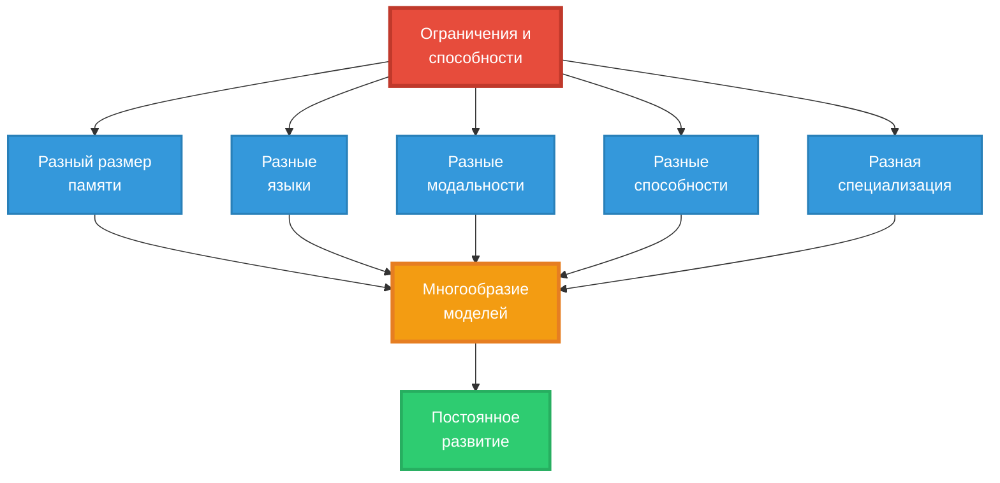

**Причины многообразия:**
- Различные ограничения и способности моделей порождают огромное многообразие вариантов
- Каждый вендор развивает свою линейку моделей с разными характеристиками и размерами
- Появляются всё новые модели, экосистема постоянно развивается и расширяется

### Слайд 12: Вендоры и их линейки моделей

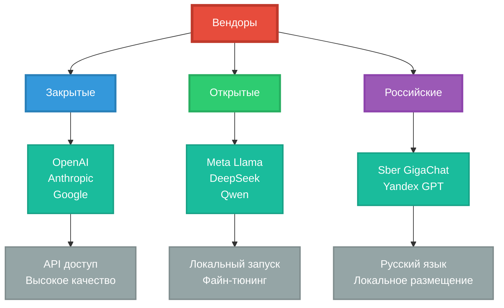

**Основные категории вендоров:**
- **Закрытые** (OpenAI, Anthropic, Google) — доступ через API, высокое качество, платная подписка
- **Открытые** (Meta Llama, DeepSeek, Qwen) — открытые веса, возможность локального запуска и файн-тюнинга
- **Российские** (Sber, Yandex) — специализация на русском языке, возможность локального размещения для соответствия требованиям

### Слайд 13: Открытые и закрытые модели

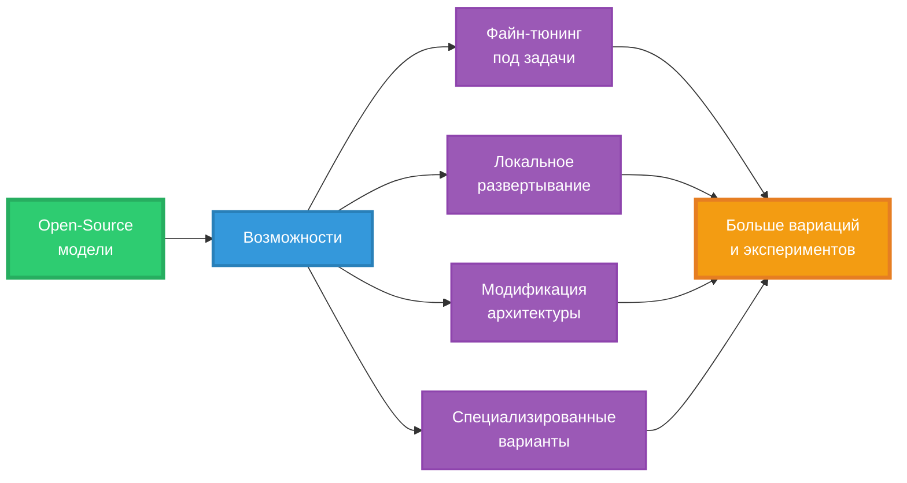

**Зачем открытые веса:**
- Открытые веса моделей открывают возможности для файн-тюнинга под специфические задачи и локального развертывания
- Возможность модификации архитектуры для экспериментов и создания специализированных моделей
- Это порождает еще больше вариаций моделей и способствует развитию экосистемы

---

## Специализация и развитие

### Слайд 14: Зачем специализировать модели

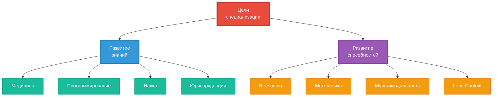

**Два направления специализации:**
- **Развитие знаний** — специализация на конкретных областях (медицина, код, наука, юриспруденция)
- **Развитие способностей** — усиление конкретных навыков (рассуждения, математика, мультимодальность, длинный контекст)
- Специализация позволяет получить лучшие результаты в конкретных задачах

---

## Оптимизация размера

### Слайд 15: Зачем уменьшать модели

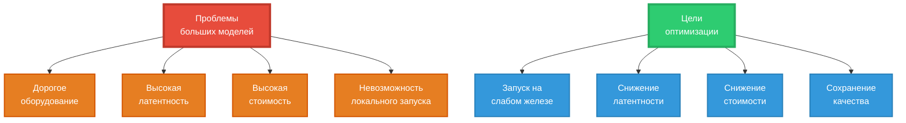

**Зачем оптимизировать:**
- Большие модели требуют мощного оборудования, работают медленно, дорого стоят и не запускаются локально
- Оптимизация позволяет запускать на обычных компьютерах, снижает задержки и стоимость
- Главная задача — уменьшить размер при сохранении приемлемого качества работы

### Слайд 16: Квантизация

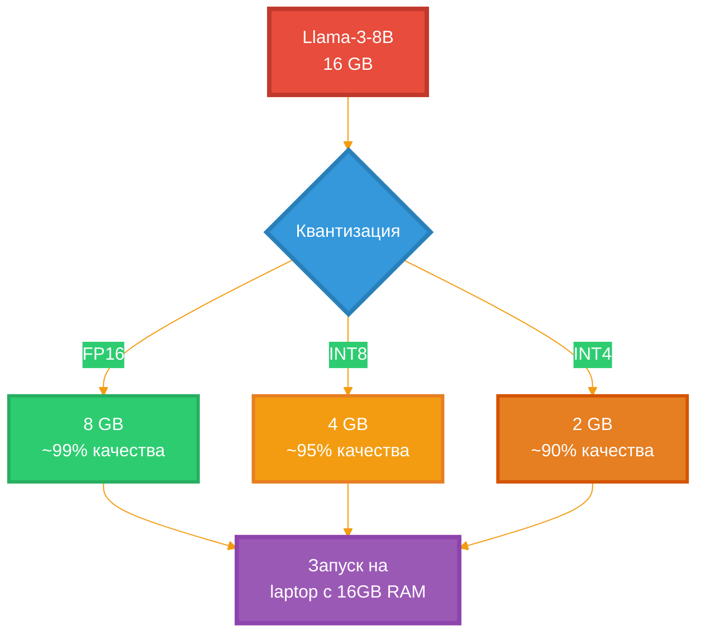

**Снижение точности весов:**
- Квантизация уменьшает количество бит на параметр — от 32/16 до 8 или даже 4 бит
- **Llama-3-8B:** 16 GB → 8 GB (FP16) → 4 GB (INT8) → 2 GB (INT4)
- Размер модели сокращается в 2-8 раз при небольшой потере качества (5-10%), позволяет запускать большие модели на обычных компьютерах

### Слайд 17: Прунинг

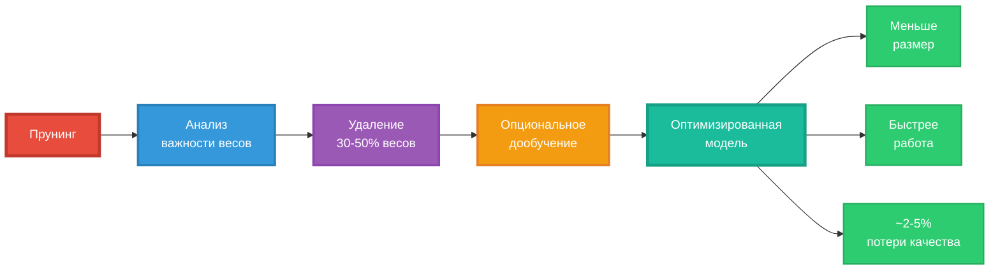

**Удаление ненужных весов:**
- Прунинг удаляет наименее важные веса из модели (обычно 30-50% параметров)
- После удаления модель может быть дообучена для восстановления качества
- Результат: уменьшение размера на 30-50%, ускорение в 1.5-3 раза, потеря качества всего 2-5%

### Слайд 18: Дистилляция

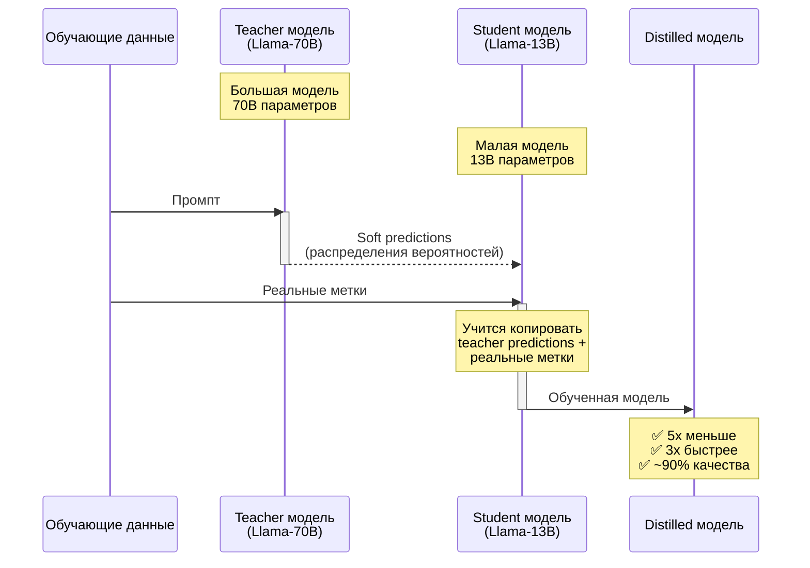

**Обучение малой модели на большой:**
- Маленькая модель (student) обучается имитировать поведение большой модели (teacher)
- Student учится не только правильным ответам, но и "стилю мышления" teacher через soft predictions
- **Пример:** Llama-70B → Llama-13B: модель в 5 раз меньше, работает в 3 раза быстрее, сохраняет ~90% качества

---

## Хабы и провайдеры

### Слайд 19: Вендоры как провайдеры

```mermaid
graph TB
    A[Прямой доступ<br/>через API вендора] --> B[Закрытые]
    A --> C[Открытые]
    A --> D[Российские]
    
    B --> B1[OpenAI API]
    B --> B2[Anthropic API]
    B --> B3[Google AI API]
    
    C --> C1[DeepSeek API]
    C --> C2[Groq API]
    
    D --> D1[GigaChat API]
    D --> D2[YandexGPT API]
    
    style A fill:#e74c3c,stroke:#c0392b,color:#fff,stroke-width:4px
    style B fill:#3498db,stroke:#2980b9,color:#fff,stroke-width:3px
    style C fill:#2ecc71,stroke:#27ae60,color:#fff,stroke-width:3px
    style D fill:#9b59b6,stroke:#8e44ad,color:#fff,stroke-width:3px
    style B1 fill:#1abc9c,stroke:#16a085,color:#fff,stroke-width:2px
    style B2 fill:#1abc9c,stroke:#16a085,color:#fff,stroke-width:2px
    style B3 fill:#1abc9c,stroke:#16a085,color:#fff,stroke-width:2px
    style C1 fill:#1abc9c,stroke:#16a085,color:#fff,stroke-width:2px
    style C2 fill:#1abc9c,stroke:#16a085,color:#fff,stroke-width:2px
    style D1 fill:#1abc9c,stroke:#16a085,color:#fff,stroke-width:2px
    style D2 fill:#1abc9c,stroke:#16a085,color:#fff,stroke-width:2px
```

**Прямой доступ к моделям вендора:**
- Каждый вендор предоставляет собственное API для доступа к своим моделям
- Закрытые вендоры (OpenAI, Anthropic, Google) предлагают высокое качество через облачный API
- Открытые и российские вендоры также предоставляют API доступ к своим моделям

### Слайд 20: Хабы моделей

```mermaid
graph LR
    A[Хабы моделей] --> B[Hugging Face]
    A --> C[OpenRouter]
    A --> D[Together AI]
    A --> E[Fireworks AI]
    
    B --> F[Единый доступ<br/>к тысячам моделей]
    C --> F
    D --> F
    E --> F
    
    F --> G[Сравнение<br/>Тестирование<br/>Быстрая смена]
    
    style A fill:#e74c3c,stroke:#c0392b,color:#fff,stroke-width:4px
    style B fill:#3498db,stroke:#2980b9,color:#fff,stroke-width:3px
    style C fill:#9b59b6,stroke:#8e44ad,color:#fff,stroke-width:3px
    style D fill:#f39c12,stroke:#e67e22,color:#fff,stroke-width:3px
    style E fill:#1abc9c,stroke:#16a085,color:#fff,stroke-width:3px
    style F fill:#2ecc71,stroke:#27ae60,color:#fff,stroke-width:4px
    style G fill:#27ae60,stroke:#229954,color:#fff,stroke-width:3px
```

**Агрегаторы моделей:**
- Хабы предоставляют единый интерфейс для доступа к множеству моделей разных вендоров
- Hugging Face — крупнейший хаб с тысячами open-source моделей и инструментами для работы с ними
- OpenRouter, Together AI, Fireworks AI — платформы для доступа к коммерческим и open-source моделям через единый API

### Слайд 21: Локальный запуск моделей

```mermaid
graph TB
    A[Локальный запуск] --> B[vLLM]
    A --> C[Ollama]
    A --> D[llama.cpp]
    A --> E[LM Studio]
    
    B --> F[Высокая<br/>производительность]
    C --> G[Простота<br/>использования]
    D --> H[CPU<br/>оптимизация]
    E --> I[GUI<br/>интерфейс]
    
    style A fill:#e74c3c,stroke:#c0392b,color:#fff,stroke-width:4px
    style B fill:#3498db,stroke:#2980b9,color:#fff,stroke-width:3px
    style C fill:#9b59b6,stroke:#8e44ad,color:#fff,stroke-width:3px
    style D fill:#f39c12,stroke:#e67e22,color:#fff,stroke-width:3px
    style E fill:#1abc9c,stroke:#16a085,color:#fff,stroke-width:3px
    style F fill:#2ecc71,stroke:#27ae60,color:#fff,stroke-width:2px
    style G fill:#2ecc71,stroke:#27ae60,color:#fff,stroke-width:2px
    style H fill:#2ecc71,stroke:#27ae60,color:#fff,stroke-width:2px
    style I fill:#2ecc71,stroke:#27ae60,color:#fff,stroke-width:2px
```

**Инструменты для локального запуска:**
- Разные инструменты для запуска моделей на вашем оборудовании (подробнее разберем на следующих уроках)
- **vLLM** — высокопроизводительный inference сервер для GPU, **Ollama** — простой инструмент с CLI
- **llama.cpp** — оптимизация для запуска на CPU, **LM Studio** — приложение с графическим интерфейсом

### Слайд 22: Зачем нужна гибкость выбора

```mermaid
graph TB
    A[Причины смены<br/>моделей/провайдеров] --> B[Развитие<br/>проекта]
    A --> C[Новые<br/>модели]
    A --> D[Изменение<br/>политик]
    A --> E[Доступность]
    A --> F[Потребности<br/>расширяются]
    
    B --> G[Нужна гибкость<br/>и легкая миграция]
    C --> G
    D --> G
    E --> G
    F --> G
    
    style A fill:#e74c3c,stroke:#c0392b,color:#fff,stroke-width:4px
    style B fill:#3498db,stroke:#2980b9,color:#fff,stroke-width:2px
    style C fill:#3498db,stroke:#2980b9,color:#fff,stroke-width:2px
    style D fill:#e67e22,stroke:#d35400,color:#fff,stroke-width:2px
    style E fill:#e67e22,stroke:#d35400,color:#fff,stroke-width:2px
    style F fill:#3498db,stroke:#2980b9,color:#fff,stroke-width:2px
    style G fill:#2ecc71,stroke:#27ae60,color:#fff,stroke-width:4px
```

**Почему важна легкая смена провайдеров:**
- Проект развивается, появляются новые модели с лучшими возможностями, меняются политики вендоров
- Доступы могут закрываться (особенно в РФ), потребности проекта расширяются
- Нужна возможность экспериментировать, сравнивать и быстро переключаться между моделями с минимумом рефакторинга

### Слайд 23: Способы доступа к API из кода

```mermaid
graph TB
    A[Варианты работы<br/>с API из кода] --> B[Прямое API<br/>вендора]
    A --> C[API хабов<br/>провайдеров]
    A --> D[Через<br/>фреймворки]
    
    B --> B1[Свой SDK<br/>для каждого]
    C --> C1[Разные<br/>интерфейсы]
    D --> D1[LangChain<br/>LlamaIndex]
    
    E[✅ Лучший выбор] --> F[OpenAI API<br/>совместимый]
    
    F --> G[Стандарт<br/>де-факто]
    F --> H[Легкая смена<br/>провайдера]
    F --> I[Минимум<br/>рефакторинга]
    F --> J[Не нужна сложность<br/>фреймворка]
    
    style A fill:#e74c3c,stroke:#c0392b,color:#fff,stroke-width:4px
    style B fill:#95a5a6,stroke:#7f8c8d,color:#fff,stroke-width:3px
    style C fill:#95a5a6,stroke:#7f8c8d,color:#fff,stroke-width:3px
    style D fill:#95a5a6,stroke:#7f8c8d,color:#fff,stroke-width:3px
    style E fill:#2ecc71,stroke:#27ae60,color:#fff,stroke-width:4px
    style F fill:#3498db,stroke:#2980b9,color:#fff,stroke-width:4px
    style G fill:#1abc9c,stroke:#16a085,color:#fff,stroke-width:2px
    style H fill:#1abc9c,stroke:#16a085,color:#fff,stroke-width:2px
    style I fill:#1abc9c,stroke:#16a085,color:#fff,stroke-width:2px
    style J fill:#1abc9c,stroke:#16a085,color:#fff,stroke-width:2px
```

**Выбор в пользу OpenAI API:**
- Можно использовать прямое API каждого вендора (свой SDK), через хабы (разные интерфейсы) или фреймворки (лишняя сложность)
- **OpenAI API стал стандартом де-факто** — большинство провайдеров поддерживают совместимый интерфейс
- Позволяет легко переключаться между провайдерами с минимумом рефакторинга — не нужна дополнительная сложность фреймворка для нашего обучения

---

## OpenAI API - стандарт де-факто

### Слайд 24: Почему OpenAI API стал стандартом

```mermaid
mindmap
  root((OpenAI API<br/>стандарт))
    Простота
      Понятный интерфейс
      Быстрый старт
      Минимум кода
    Документация
      Отличные гайды
      Примеры
      Best practices
    Сообщество
      Огромное комьюнити
      Множество библиотек
      Stack Overflow
    Совместимость
      OpenAI
      Anthropic
      OpenRouter
      DeepSeek
      GigaChat
      80+ провайдеров
```

**Преимущества стандарта:**

**Простота использования:**
```python
# Всего 5 строк для первого запроса!
from openai import OpenAI

client = OpenAI(api_key="your-key")
response = client.chat.completions.create(
    model="gpt-4",
    messages=[{"role": "user", "content": "Hello!"}]
)
print(response.choices[0].message.content)
```

**Совместимость:**
- 80+ провайдеров поддерживают OpenAI-совместимый API
- Один и тот же код работает с разными провайдерами
- Огромное сообщество, множество примеров и туториалов

### Слайд 25: Структура взаимодействия с API

```mermaid
sequenceDiagram
    participant App as Ваше приложение
    participant Client as OpenAI Client
    participant API as API провайдера
    
    Note over Client: Configuration:<br/>base_url, api_key, model
    
    App->>Client: Создание запроса
    activate Client
    Note over App,Client: messages, temperature,<br/>max_tokens
    Client->>API: HTTP POST /chat/completions
    activate API
    Note over API: Обработка запроса<br/>моделью
    API-->>Client: Response
    deactivate API
    Note over API,Client: choices, usage,<br/>metadata
    Client-->>App: Parsed response
    deactivate Client
```

**Основные компоненты:**
- **Configuration** — настройки подключения (base_url, api_key) и выбор модели
- **Request** — ваш запрос с сообщениями (messages), параметрами генерации (temperature, max_tokens)
- **Response** — ответ с результатом генерации (choices), информацией об использовании токенов (usage) и метаданными

### Слайд 26: Что меняется при смене провайдера

```mermaid
flowchart TB
    subgraph unchanged["❌ НЕ МЕНЯЕТСЯ"]
        A1[Код приложения]
        A2[Логика работы]
        A3[Структура запросов]
        A4[Обработка ответов]
        A5[UI/UX]
    end
    
    subgraph changed["✅ МЕНЯЕТСЯ ТОЛЬКО"]
        B1[base_url]
        B2[api_key]
        B3[model name]
    end
    
    C[Смена провайдера] --> unchanged
    C --> changed
    
    changed --> D[Конфигурация<br/>3 строки!]
    
    style unchanged fill:#2ecc71,stroke:#27ae60,color:#fff,stroke-width:3px
    style changed fill:#e74c3c,stroke:#c0392b,color:#fff,stroke-width:3px
    style C fill:#3498db,stroke:#2980b9,color:#fff,stroke-width:4px
    style D fill:#f39c12,stroke:#e67e22,color:#fff,stroke-width:3px
```

**Легкая миграция:**
```python
# ❌ НЕ меняется: весь код приложения
def process_user_request(user_input):
    response = client.chat.completions.create(
        model=CONFIG["model"],  # ← из конфига
        messages=[{"role": "user", "content": user_input}]
    )
    return response.choices[0].message.content

# ✅ Меняется: только конфигурация (3 строки!)
CONFIG = {
    "base_url": "https://api.openai.com/v1",      # ← меняем
    "api_key": "your-key",                         # ← меняем
    "model": "gpt-4"                               # ← меняем
}
```

- Весь код приложения остается неизменным — логика, структура запросов, обработка ответов
- Меняется только конфигурация: URL, API ключ и название модели — всего 3 строки!

### Слайд 27: Пример переключения между провайдерами

```mermaid
flowchart LR
    A[Ваш код<br/>НЕ меняется] --> B[OpenAI API Client]
    
    B --> C[OpenAI]
    B --> D[OpenRouter]
    B --> E[DeepSeek]
    B --> F[GigaChat]
    
    C --> G[✅ Меняется только<br/>конфигурация]
    D --> G
    E --> G
    F --> G
    
    style A fill:#2ecc71,stroke:#27ae60,color:#fff,stroke-width:4px
    style B fill:#e74c3c,stroke:#c0392b,color:#fff,stroke-width:4px
    style C fill:#3498db,stroke:#2980b9,color:#fff,stroke-width:3px
    style D fill:#9b59b6,stroke:#8e44ad,color:#fff,stroke-width:3px
    style E fill:#f39c12,stroke:#e67e22,color:#fff,stroke-width:3px
    style F fill:#1abc9c,stroke:#16a085,color:#fff,stroke-width:3px
    style G fill:#f39c12,stroke:#e67e22,color:#fff,stroke-width:4px
```

**Переключение на практике:**

**OpenAI:**
```python
from openai import OpenAI

client = OpenAI(
    base_url="https://api.openai.com/v1",       # ← меняем
    api_key="your-openai-key"                   # ← меняем
)

response = client.chat.completions.create(
    model="gpt-4",                              # ← меняем
    messages=[{"role": "user", "content": "Hello!"}]
)
```

**OpenRouter (Claude):**
```python
client = OpenAI(
    base_url="https://openrouter.ai/api/v1",   # ← меняем
    api_key="your-openrouter-key"              # ← меняем
)

response = client.chat.completions.create(
    model="anthropic/claude-3.5-sonnet",       # ← меняем
    messages=[{"role": "user", "content": "Hello!"}]
)
```

**DeepSeek:**
```python
client = OpenAI(
    base_url="https://api.deepseek.com/v1",    # ← меняем
    api_key="your-deepseek-key"                # ← меняем
)

response = client.chat.completions.create(
    model="deepseek-chat",                     # ← меняем
    messages=[{"role": "user", "content": "Hello!"}]
)
```

**Весь остальной код остается одинаковым!**

---

